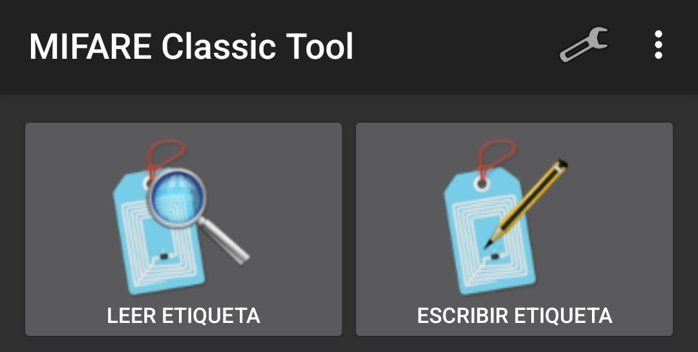
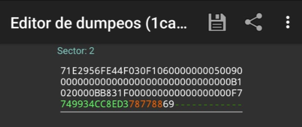

# README

## Crackeo de Claves Privadas de Tarjetas Mifare Classic 1K

Este repositorio alberga una prueba de concepto que demuestra la vulnerabilidad de las tarjetas Mifare Classic 1K (en concreto, las tarjetas de transporte público Renfe&Tú) y cómo es posible crackear sus claves privadas. El proyecto se basa en mi investigación y experimentación en el campo de la ciberseguridad, y tiene como objetivo ilustrar las implicaciones de seguridad asociadas con estas tarjetas ampliamente utilizadas.
#
## Objetivo

El objetivo principal de este proyecto es aumentar la conciencia sobre la importancia de la seguridad en sistemas de acceso y autenticación que dependen de tarjetas Mifare Classic 1K. También se pretende fomentar la discusión sobre posibles soluciones y mejores prácticas para mitigar estas vulnerabilidades.
#
Nota Legal:

- Este proyecto se realiza con fines educativos y de investigación. No se alienta ni respalda ningún uso ilegal o malicioso de esta información. Los usuarios deben cumplir con todas las leyes y regulaciones aplicables en su jurisdicción.

## Herramientas Empleadas:

- Lector NFC ACR122U.
- Tarjetas Mifare Classic 1K para pruebas.
- Aplicación móvil MIFARE Classic Tools.
- mfoc linux software.
#
# PRUEBA DE CONCEPTO ##

La tarjeta escogida para llevar a cabo la explotación es la tarjeta de trasnporte público recargable Renfe&Tú. 

 

Para iniciar la lectura de la memoria debemos pulsar en "LEER ETIQUETA". En el menú de lectura, tenemos que seleccionar un diccionario de claves. En este caso, seleccionaremos los diccionarios por defecto de la aplicación.

 

Como podemos ver en la siguiente imagen, la aplicación ha conseguido obtener una clave A, por lo que seremos capaces de acceder a la lectura del sector 2. 

Al haber obtenido una clave A válida podemos lanzar ataques "Hardnested" para ir obteniendo las claves A de todos los sectores. Para ello, utilizaremos la herramienta "mfoc", a la que le indicaremos esta clave que hemos obtenido con el flag -k.

La herramienta indica que la clave ha sido válida para autenticarse en el sector 2 pero no finaliza. Mfoc arranca otra vez automáticamente para lanzar ataques consecutivos y conseguir claves hasta que la detengamos manualmente.

Como se observa en la ilustración anterior, mfoc se ha iniciado de nuevo automáticamente y ha conseguido obtener otra clave A.
