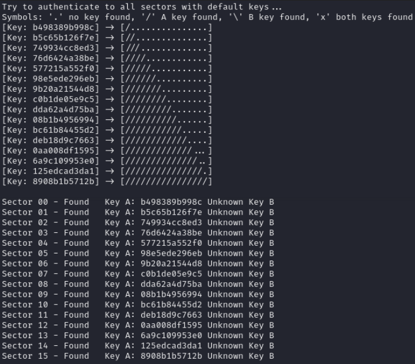

# README

## Crackeo de Claves Privadas de Tarjetas Mifare Classic 1K

Este repositorio alberga una prueba de concepto que demuestra la vulnerabilidad de las tarjetas Mifare Classic 1K (en concreto, las tarjetas de transporte público Renfe&Tú) y cómo es posible crackear sus claves privadas. El proyecto se basa en mi investigación y experimentación en el campo de la ciberseguridad, y tiene como objetivo ilustrar las implicaciones de seguridad asociadas con estas tarjetas ampliamente utilizadas.
#
## Objetivo

El objetivo principal de este proyecto es aumentar la conciencia sobre la importancia de la seguridad en sistemas de acceso y autenticación que dependen de tarjetas Mifare Classic 1K. También se pretende fomentar la discusión sobre posibles soluciones y mejores prácticas para mitigar estas vulnerabilidades.
#
Nota Legal:

- Este proyecto se realiza con fines educativos y de investigación. No se alienta ni respalda ningún uso ilegal o malicioso de esta información. Los usuarios deben cumplir con todas las leyes y regulaciones aplicables en su jurisdicción.

## Herramientas Empleadas:

- Lector NFC ACR122U.
- Tarjetas Mifare Classic 1K para pruebas.
- Aplicación móvil MIFARE Classic Tools.
- mfoc linux software.
#
# ESTRUCTURA MIFARE CLASSIC 1K ##

Se organiza en sectores, bloques y bytes.
- Sectores: La tarjeta Mifare Classic 1K se divide en 16 sectores. Cada sector tiene un número de identificación único y se utiliza para almacenar datos específicos.
- Bloques: Cada sector consta de 4 bloques de datos numerados del 0 al 3. Cada bloque tiene una capacidad de almacenamiento de 16 bytes.
- Bytes en Bloques: Cada bloque contiene 16 bytes de datos, que se utilizan para almacenar información, como identificadores, claves de acceso u otros datos relevantes.

Además, la información está protegida por una clave A (normalmente para la lectura de la memoria) y una clave B (normalmente para la escritura y la modificación de permisos. Si intentamos leet la tarjeta sin conocer las claves, no conseguiremos acceder a leer la información.
#
```
┌──(kali㉿kali)-[~]
└─$ mfoc -O renfe
ATS 0C0C757780|02C1052130
Found Mifare Classic 1k tag
ISO/IEC 14443A (106 kbps) target:
    ATQA (SENS_RES): 00  04  
* UID size: single
* bit frame anticollision supported
       UID (NFCID1): 1e  7e  0f  03  
      SAK (SEL_RES): 08  
* Not compliant with ISO/IEC 14443-4
* Not compliant with ISO/IEC 18092

Fingerprinting based on MIFARE type Identification Procedure:
* MIFARE Classic 1K
* MIFARE Plus (4 Byte UID or 4 Byte RID) 2K, Security level 1
* SmartMX with MIFARE 1K emulation
Other possible matches based on ATQA & SAK values:

Try to authenticate to all sectors with default keys...
Symbols: '.' no key found, '/' A key found, '\' B key found, 'x' both keys found
[Key: ffffffffffff] -> [................]
[Key: a0a1a2a3a4a5] -> [................]
[Key: d3f7d3f7d3f7] -> [................]
[Key: 000000000000] -> [................]
[Key: b0b1b2b3b4b5] -> [................]
[Key: 4d3a99c351dd] -> [................]
[Key: 1a982c7e459a] -> [................]
[Key: aabbccddeeff] -> [................]
[Key: 714c5c886e97] -> [................]
[Key: 587ee5f9350f] -> [................]
[Key: a0478cc39091] -> [................]
[Key: 533cb6c723f6] -> [................]
[Key: 8fd0a4f256e9] -> [................]

Sector 00 - Unknown Key A               Unknown Key B
Sector 01 - Unknown Key A               Unknown Key B
Sector 02 - Unknown Key A               Unknown Key B
Sector 03 - Unknown Key A               Unknown Key B
Sector 04 - Unknown Key A               Unknown Key B
Sector 05 - Unknown Key A               Unknown Key B
Sector 06 - Unknown Key A               Unknown Key B
Sector 07 - Unknown Key A               Unknown Key B
Sector 08 - Unknown Key A               Unknown Key B
Sector 09 - Unknown Key A               Unknown Key B
Sector 10 - Unknown Key A               Unknown Key B
Sector 11 - Unknown Key A               Unknown Key B
Sector 12 - Unknown Key A               Unknown Key B
Sector 13 - Unknown Key A               Unknown Key B
Sector 14 - Unknown Key A               Unknown Key B
Sector 15 - Unknown Key A               Unknown Key B
mfoc: ERROR: 

No sector encrypted with the default key has been found, exiting..
```

#
# PRUEBA DE CONCEPTO ##

La tarjeta escogida para llevar a cabo la explotación es la tarjeta de trasnporte público recargable Renfe&Tú. 

 

Para iniciar la lectura de la memoria debemos pulsar en "LEER ETIQUETA". En el menú de lectura, tenemos que seleccionar un diccionario de claves. En este caso, seleccionaremos los diccionarios por defecto de la aplicación.

 

Como podemos ver en la siguiente imagen, la aplicación ha conseguido obtener una clave A, por lo que seremos capaces de acceder a la lectura del sector 2. 


Al haber obtenido una clave A válida podemos lanzar ataques "Hardnested" para ir obteniendo las claves A de todos los sectores. Para ello, utilizaremos la herramienta "mfoc", a la que le indicaremos esta clave que hemos obtenido con el flag -k.


La herramienta indica que la clave ha sido válida para autenticarse en el sector 2 pero no finaliza. Mfoc arranca otra vez automáticamente para lanzar ataques consecutivos y conseguir claves hasta que la detengamos manualmente.


Como se observa en la ilustración anterior, mfoc se ha iniciado de nuevo automáticamente y ha conseguido obtener otra clave A, en este caso del sector 0.
##
***Por lo general (al menos en mi caso) necesita alrededor de 10-15 minutos para obtener la clave de cada sector, pero también ha dejado de funcionar en numerosas ocasiones, por lo que el proceso es posible que se demore un extra de tiempo.*** 
##
#


Una vez la herramienta ha conseguido todas las claves, podremos guardarlas en un fichero y pasarlas a la apliación MIFARE Classic Tool para que la utilice como diccionario y así poder leer los datos de la tarjeta de manera rápida desde la aplicación.


#
# IMPLICACIONES DE SEGURIDAD ##

## Implicaciones de Seguridad

El propósito de este proyecto es educativo y de investigación. Sin embargo, es importante comprender las implicaciones de seguridad asociadas con el crackeo de las tarjetas Mifare Classic 1K, específicamente las tarjetas de transporte público Renfe&Tú. A continuación, se detallan algunas consideraciones de seguridad relevantes:

1. **Fraude en el Transporte Público**: Este proyecto ilustra cómo un atacante podría utilizar tarjetas crackeadas para eludir los sistemas de control de acceso en el transporte público. Esto podría tener implicaciones financieras para la empresa de transporte.

2. **Posible Acceso No Autorizado**: Si las tarjetas Mifare Classic 1K se utilizan para el acceso a áreas sensibles o sistemas críticos, el crackeo de estas tarjetas podría permitir a un atacante ingresar a áreas restringidas sin autorización, lo que plantea un riesgo para la seguridad.

3. **Suplantación de Identidad**: Los atacantes podrían suplantar la identidad de usuarios legítimos al utilizar tarjetas crackeadas. Esto podría dar lugar a actividades fraudulentas en nombre de usuarios legítimos.

4. **Extorsión Potencial**: Los atacantes podrían utilizar información comprometida o datos de tarjetas crackeadas como palanca para extorsionar a la organización, solicitando un rescate a cambio de no explotar la información.

5. **Daño a la Reputación**: La divulgación de un incidente de seguridad relacionado con las tarjetas Mifare Classic 1K podría dañar la reputación de la empresa y la confianza de los usuarios.

6. **Riesgo de Litigios**: Los usuarios afectados podrían emprender acciones legales si se demuestra que su información o seguridad se vieron comprometidas debido al crackeo de tarjetas, lo que podría resultar en litigios.

7. **Pérdida de Clientes**: La pérdida de confianza de los usuarios en la seguridad de los sistemas de acceso podría llevar a la pérdida de clientes y a una disminución de los ingresos.

8. **Costos de Reemplazo y Actualización**: La organización podría enfrentar costos relacionados con el reemplazo de las tarjetas Mifare Classic 1K y la actualización de sistemas de seguridad para abordar la vulnerabilidad.

Es fundamental entender que este proyecto se realiza con fines educativos y de investigación. No se promueve ningún uso ilegal o malicioso de la información proporcionada. Los usuarios deben cumplir con todas las leyes y regulaciones aplicables en su jurisdicción.
